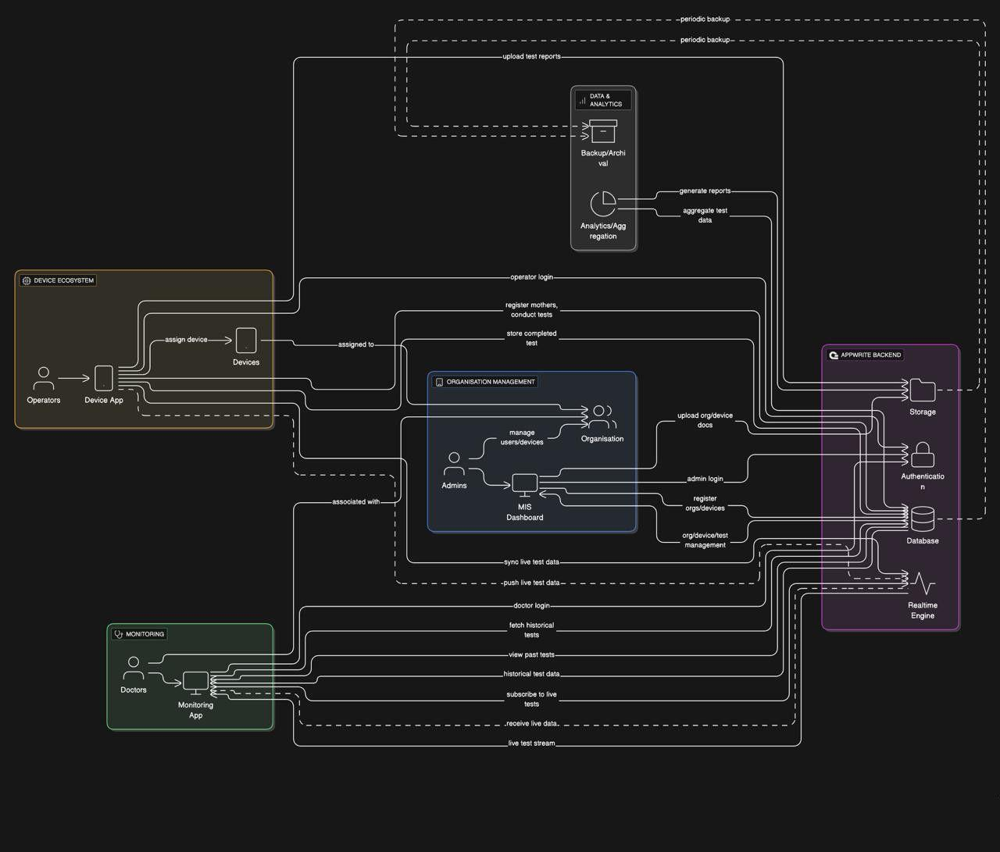

# FetosenseRemote Flutter App

[](https://flutter.dev/)

A Flutter application for remote fetal monitoring, developed by CareNX Innovations Pvt. Ltd.

## Overview

FetosenseRemote is a mobile application that works with the Fetosense device to provide remote fetal monitoring capabilities for healthcare providers and expectant mothers. The app facilitates telemedicine for maternal healthcare by enabling real-time monitoring, data collection, and analysis of fetal health parameters.

## Features

- **Remote Monitoring**: Track fetal heart rate and maternal parameters remotely
- **User Authentication**: Secure login for healthcare providers and patients
- **Data Visualization**: Real-time visualization of fetal monitoring data
- **Record Management**: Store and manage patient records
- **Notification System**: Alerts for critical events or readings
- **Telemedicine Integration**: Connect patients with healthcare providers
- **Offline Mode**: Access essential features without internet connectivity

## Getting Started

### Prerequisites

- Flutter SDK (3.24.5)
- Dart SDK
- Android Studio / Xcode
- A physical device or emulator for testing

### Installation

1. Clone the repository:
   ```
   git clone https://github.com/CareNX-Innovations-Pvt-Ltd/fetosense_remote_flutter.git
   ```

2. Navigate to the project directory:
   ```
   cd fetosense_remote_flutter
   ```

3. Install dependencies:
   ```
   flutter pub get
   ```

4. Run the application:
   ```
   flutter run
   ```

## Project Structure

```
lib/
├── api/            # API integration services
├── bloc/           # Business logic components
├── models/         # Data models
├── screens/        # UI screens
├── utils/          # Utility functions and helpers
├── widgets/        # Reusable widgets
└── main.dart       # Application entry point
```

## Deployment

### Android

1. Generate a keystore file:
   ```
   keytool -genkey -v -keystore fetosense.keystore -alias fetosense -keyalg RSA -keysize 2048 -validity 10000
   ```

2. Build the APK:
   ```
   flutter build apk --release
   ```

### iOS

1. Set up your iOS signing certificate in Xcode
2. Build the app:
   ```
   flutter build ios --release
   ```

## Contributing

1. Fork the repository
2. Create your feature branch (`git checkout -b feature/amazing-feature`)
3. Commit your changes (`git commit -m 'Add some amazing feature'`)
4. Push to the branch (`git push origin feature/amazing-feature`)
5. Open a Pull Request

## Developer Documentation

You can find the complete developer documentation [here](https://carenx-innovations-pvt-ltd.github.io/fetosense_remote_flutter/).

## System Architecture Diagram


## About CareNX Innovations

CareNX Innovations is a healthcare technology company focused on developing innovative solutions for maternal and fetal healthcare. The Fetosense device and companion applications are designed to improve access to quality healthcare for expectant mothers, especially in remote and underserved areas.

## Contact

CareNX Innovations Pvt. Ltd.
- Website: [https://www.carenx.com](https://www.carenx.com)
- Email: support@carenx.com

## Acknowledgments

- Thanks to all healthcare providers and mothers who provided feedback during development
- Flutter and Dart communities for excellent documentation and support
